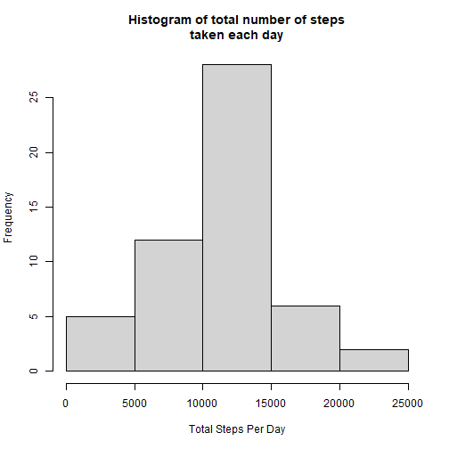
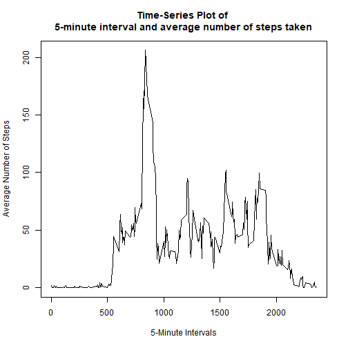
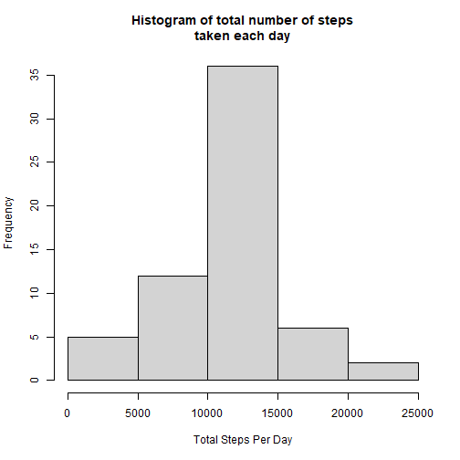
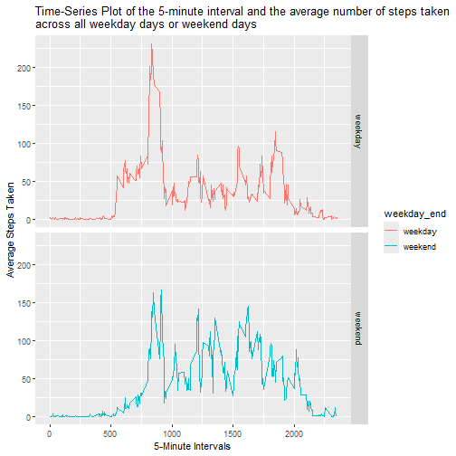

## Loading and preprocessing the data

To load the data in R, download the file from [Activity_Data](https://github.com/AK282331/RepData_PeerAssessment1/blob/master/activity.zip) and then save the file in that directory which you have set as a current working directory in R.


```r
activity = read.csv(file = "C:\\Users\\Abhinav Khandelwal\\Desktop\\R_project\\R_Learning_Coursera\\activity.csv")
```

```r
### Converting date from character to date format

activity$date = as.Date(activity$date,format = "%Y-%m-%d")
head(activity)
```

```
##   steps       date interval
## 1    NA 2012-10-01        0
## 2    NA 2012-10-01        5
## 3    NA 2012-10-01       10
## 4    NA 2012-10-01       15
## 5    NA 2012-10-01       20
## 6    NA 2012-10-01       25
```


## What is mean total number of steps taken per day?

**1. Calculate the total number of steps taken per day.**


```r
activity = activity[complete.cases(activity),]
total_steps = activity %>% group_by(date) %>% summarise(sum(steps,na.rm = T)) %>%  as.data.frame()
total_steps
```

```
##          date sum(steps, na.rm = T)
## 1  2012-10-02                   126
## 2  2012-10-03                 11352
## 3  2012-10-04                 12116
## 4  2012-10-05                 13294
## 5  2012-10-06                 15420
## 6  2012-10-07                 11015
## 7  2012-10-09                 12811
## 8  2012-10-10                  9900
## 9  2012-10-11                 10304
## 10 2012-10-12                 17382
## 11 2012-10-13                 12426
## 12 2012-10-14                 15098
## 13 2012-10-15                 10139
## 14 2012-10-16                 15084
## 15 2012-10-17                 13452
## 16 2012-10-18                 10056
## 17 2012-10-19                 11829
## 18 2012-10-20                 10395
## 19 2012-10-21                  8821
## 20 2012-10-22                 13460
## 21 2012-10-23                  8918
## 22 2012-10-24                  8355
## 23 2012-10-25                  2492
## 24 2012-10-26                  6778
## 25 2012-10-27                 10119
## 26 2012-10-28                 11458
## 27 2012-10-29                  5018
## 28 2012-10-30                  9819
## 29 2012-10-31                 15414
## 30 2012-11-02                 10600
## 31 2012-11-03                 10571
## 32 2012-11-05                 10439
## 33 2012-11-06                  8334
## 34 2012-11-07                 12883
## 35 2012-11-08                  3219
## 36 2012-11-11                 12608
## 37 2012-11-12                 10765
## 38 2012-11-13                  7336
## 39 2012-11-15                    41
## 40 2012-11-16                  5441
## 41 2012-11-17                 14339
## 42 2012-11-18                 15110
## 43 2012-11-19                  8841
## 44 2012-11-20                  4472
## 45 2012-11-21                 12787
## 46 2012-11-22                 20427
## 47 2012-11-23                 21194
## 48 2012-11-24                 14478
## 49 2012-11-25                 11834
## 50 2012-11-26                 11162
## 51 2012-11-27                 13646
## 52 2012-11-28                 10183
## 53 2012-11-29                  7047
```

**2. Make a histogram of the total number of steps taken each day.**


```r
hist(total_steps$`sum(steps, na.rm = T)`,xlab = "Total Steps Per Day",main = "Histogram of total number of steps\ntaken each day")
```



**3.Calculate and report the mean and median of the total number of steps taken per day.**


```r
total_steps_mean = mean(total_steps$`sum(steps, na.rm = T)`)
total_steps_median = median(total_steps$`sum(steps, na.rm = T)`)
cat ("total_steps_mean = ",total_steps_mean)
```

```
## total_steps_mean =  10766.19
```

```r
cat ("total_steps_median = ",total_steps_median)
```

```
## total_steps_median =  10765
```

## What is the average daily activity pattern?

**1.Make a time series plot (i.e.type = "l") of the 5-minute interval (x-axis) and the average number of steps taken, averaged across all days (y-axis)**

For the above question we need to first calculate the averages of steps taken on the basis of intervals.


```r
interval_avg = tapply(activity$steps,factor(activity$interval),mean)
interval_avg = data.frame(intervals = unique(activity$interval),average = interval_avg)
head(interval_avg)
```

```
##    intervals   average
## 0          0 1.7169811
## 5          5 0.3396226
## 10        10 0.1320755
## 15        15 0.1509434
## 20        20 0.0754717
## 25        25 2.0943396
```


```r
plot(interval_avg$intervals,interval_avg$average, type = "l",main = "Time-Series Plot of \n5-minute interval and average number of steps taken",xlab = "5-Minute Intervals",ylab = "Average Number of Steps")
```



**2.Which 5-minute interval, on average across all the days in the dataset, contains the maximum number of steps?**


```r
interval_avg[which.max(interval_avg$average),]
```

```
##     intervals  average
## 835       835 206.1698
```

## Imputing missing values

**1.Calculate and report the total number of missing values in the dataset (i.e. the total number of rows with NAs)**


```r
activity2 = read.csv(file = "C:\\Users\\Abhinav Khandelwal\\Desktop\\R_project\\R_Learning_Coursera\\activity.csv")

head(activity2)
```

```
##   steps       date interval
## 1    NA 2012-10-01        0
## 2    NA 2012-10-01        5
## 3    NA 2012-10-01       10
## 4    NA 2012-10-01       15
## 5    NA 2012-10-01       20
## 6    NA 2012-10-01       25
```


```r
Nas = sum(!complete.cases(activity2))
Nas
```

```
## [1] 2304
```

**2.Devise a strategy for filling in all of the missing values in the dataset. The strategy does not need to be sophisticated. For example, you could use the mean/median for that day, or the mean for that 5-minute interval, etc.**

Here my strategy is to use the average of 5-minute interval in place of Na's.


```r
activity_null = filter(activity2,is.na(steps))
for (i in unique(activity_null$interval)){
    avg = interval_avg[interval_avg$intervals==i,2]
    activity_null$steps= replace(activity_null$steps,activity_null$interval == i,avg)
    
}
head(activity_null)
```

```
##       steps       date interval
## 1 1.7169811 2012-10-01        0
## 2 0.3396226 2012-10-01        5
## 3 0.1320755 2012-10-01       10
## 4 0.1509434 2012-10-01       15
## 5 0.0754717 2012-10-01       20
## 6 2.0943396 2012-10-01       25
```

**3.Create a new dataset that is equal to the original dataset but with the missing data filled in.**


```r
for (i in unique(activity2$interval)){
        val = interval_avg[interval_avg$intervals==i,2]
        activity2$steps = replace(activity2$steps,activity2$interval==i & is.na(activity2$steps),val)  }
   
head(activity2)                                     
```

```
##       steps       date interval
## 1 1.7169811 2012-10-01        0
## 2 0.3396226 2012-10-01        5
## 3 0.1320755 2012-10-01       10
## 4 0.1509434 2012-10-01       15
## 5 0.0754717 2012-10-01       20
## 6 2.0943396 2012-10-01       25
```

**4.Make a histogram of the total number of steps taken each day**


```r
activity2$date = as.Date(activity2$date,format = "%Y-%m-%d")
total_steps_new = activity2 %>% group_by(date) %>% summarise(sum(steps))
hist(total_steps_new$`sum(steps)`,xlab = "Total Steps Per Day",main = "Histogram of total number of steps\ntaken each day")
```



**4. and Calculate and report the mean and median total number of steps taken per day.**  

```r
total_steps_new_mean = mean(total_steps_new$`sum(steps)`)
total_steps_new_median = median(total_steps_new$`sum(steps)`)

cat("total_steps_new_mean = ",total_steps_new_mean)
```

```
## total_steps_new_mean =  10766.19
```

```r
cat("total_steps_new_median = ",total_steps_new_median)
```

```
## total_steps_new_median =  10766.19
```


**4.Do these values differ from the estimates from the first part of the assignment? What is the impact of imputing missing data on the estimates of the total daily number of steps?**

When we had the data with NAs then the mean was1.0766189 &times; 10<sup>4</sup> and median was 10765. Now after imputing the NA's we have mean 1.0766189 &times; 10<sup>4</sup> and median 1.0766189 &times; 10<sup>4</sup>. With this we can see that there is no change in the mean but there is a change in the median of 1.19 steps and npw we have normal distribution.

## Are there differences in activity patterns between weekdays and weekends?

**1.Create a new factor variable in the dataset with two levels – “weekday” and “weekend” indicating whether a given date is a weekday or weekend day.**


```r
activity2 = mutate(activity2,days = weekdays(date),weekday_end = case_when(days %in% c("Monday","Tuesday","Wednesday","Thursday","Friday")~"weekday",days %in% c("Saturday", "Sunday") ~ "weekend")) %>% select(-4) %>% as.data.frame()

activity2$weekday_end = factor(activity2$weekday_end)

head(activity2)
```

```
##       steps       date interval weekday_end
## 1 1.7169811 2012-10-01        0     weekday
## 2 0.3396226 2012-10-01        5     weekday
## 3 0.1320755 2012-10-01       10     weekday
## 4 0.1509434 2012-10-01       15     weekday
## 5 0.0754717 2012-10-01       20     weekday
## 6 2.0943396 2012-10-01       25     weekday
```

**2.Make a panel plot containing a time series plot (i.e. type = "l") of the 5-minute interval (x-axis) and the average number of steps taken, averaged across all weekday days or weekend days (y-axis). See the README file in the GitHub repository to see an example of what this plot should look like using simulated data.**


```r
## Creating a new data frame which contains the interval and their averages

interval_avg_new = activity2 %>% group_by(interval,weekday_end) %>% summarise(mean(steps)) %>% as.data.frame() %>% rename(average_steps = 'mean(steps)')
```

```
## `summarise()` has grouped output by 'interval'. You can override using the `.groups` argument.
```

```r
## Creating Time-Series Plot

gg = ggplot(interval_avg_new,aes(interval,average_steps,col = weekday_end))
gg+geom_line() + facet_grid(weekday_end~.) + ggtitle(label = "Time-Series Plot of the 5-minute interval and the average number of steps taken \nacross all weekday days or weekend days") + xlab("5-Minute Intervals") + ylab("Average Steps Taken")
```


            


